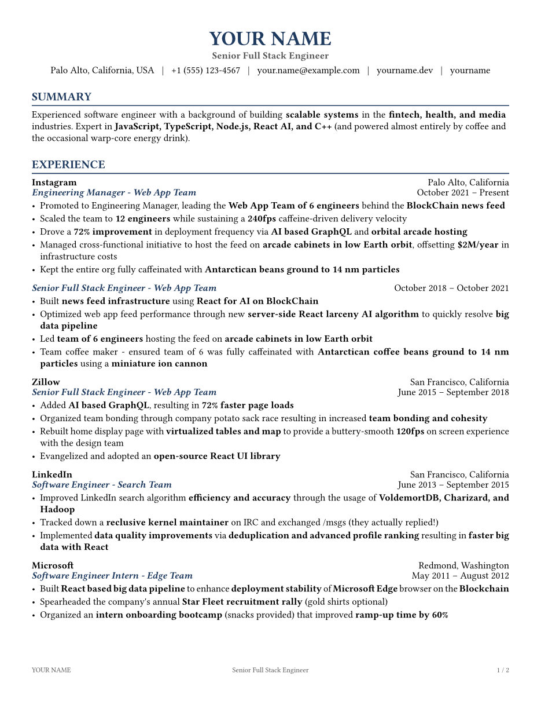
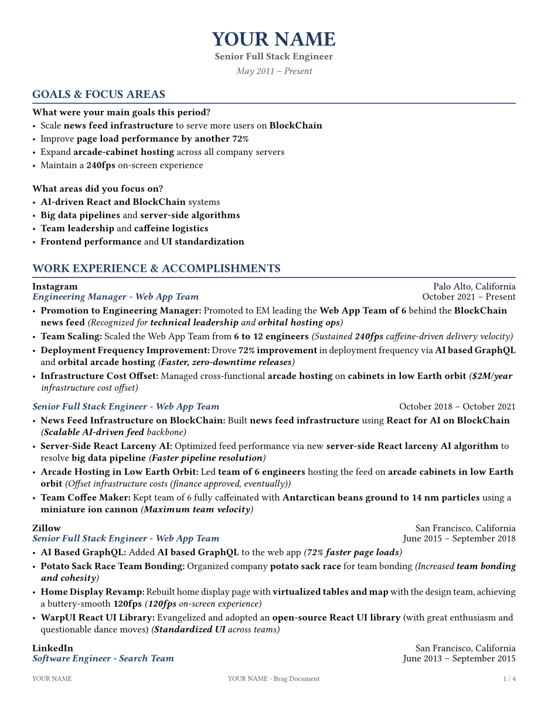

# Resume & Brag Document Template

A professional resume and brag document template built with [Typst](https://typst.app). Generate clean, ATS-friendly PDFs for your resume and career brag document from a single shared template system (`src/functions.typ`).

Sample data is satirical — replace it with your own career information.

 

## Features

- **Single shared style system** — `functions.typ` powers both documents (typography, colors, headers, footers)
- **Bold highlights in bullets & summaries** — wrap any keyword/metric with `*...*` to emphasize it (e.g., `*69% faster*`, `*React + TypeScript*`)
- **Resume sections** — summary, experience, education, skills, projects
- **Brag document sections** — goals & focus areas, work accomplishments, major accomplishments, collaboration, skills & growth, feedback, projects & initiatives, metrics & impact
- **Live preview & one-command builds** via `TASKFILE.yml` or plain `typst` CLI
- **Automated releases** — every merge/push to `master` cuts the next `v1.N` release with dated PDFs and a What's Changed section

## What's Included

| File | Purpose |
|------|---------|
| `src/resume.typ` | Resume data and entry point — edit personal info, summary, experience, education, skills, projects |
| `src/bragdoc.typ` | Brag document data and entry point — edit goals, accomplishments, collaborations, skills, feedback, projects, metrics |
| `src/functions.typ` | Shared layout, style rules, and render helpers (`cvinit`, `render-*`, `parse-bold`, `daterange_short`) |

Generated PDFs (`src/resume.pdf`, `src/bragdoc.pdf`) are gitignored build outputs (see `.gitignore`); previews are `preview-*.png`. Releases attach dated copies.

## Bold Highlights

This template includes a lightweight markup parser `parse-bold` (`src/functions.typ`) that renders `*text*` as bold. Use it to make metrics, technologies, and impact stand out in scans. Single `*...*` toggles bold; `**` renders a literal `*`; an unclosed trailing `*` is rendered literally.

**Where it is supported:**

- **Resume** — `summary` (`render-summary`) and every bullet in `works[].positions[].highlights` + `projects[].highlights` (`render-work`, `render-project`)
- **Brag document** — `goals`/`focus-areas` (`render-goals`), role accomplishments `description`/`impact` (`render-work-accomplishments`), major accomplishments `what`/`why`/`impact` (`render-accomplishments`), collaborations `contribution` (`render-collaboration`), `skills`/`challenges` (`render-skills`), feedback `quote` (`render-feedback`), project `highlights`/`metrics` (`render-bragdoc-projects`), metrics `value`/`description` (`render-metrics`)

**Syntax:**

```typst
#let summary = "Built *scalable systems* in *fintech and media* with *TypeScript, React and Node.js*."

#let works = (
  (
    name: "Acme",
    positions: (
      (
        position: "Senior Engineer",
        highlights: (
          "Drove a *69% improvement* in deployment frequency via *AI-based GraphQL*",
          "Scaled team to *12 engineers* while sustaining *420fps* delivery velocity",
          "Offset *$2M/year* in infra costs with *on-server Ethereum mining*",
        ),
      ),
    ),
  ),
)
```

**Tips:**

- Bold the *result* first (numbers, %, $, stack) and the *key action* second — e.g., `*69% faster page loads* via *virtualized tables*`.
- Keep it to 1–2 bolds per bullet; over-bolding reduces scanability.
- Special cases: `**` renders a literal `*`, and an unclosed trailing `*` is shown literally — so `2 * 3` stays as-is.

## Quick Start

### Prerequisites

- [Typst 0.15.1+](https://typst.app/docs/install/) (CI pins `0.15.1` in `.github/workflows/release.yml`; newer local versions may render slightly differently)
- No font install needed — **IBM Plex Sans** (Regular/Bold/Italic/BoldItalic, OFL-licensed) is vendored in `src/fonts/` and picked up via `--font-path src/fonts` (already wired into `TASKFILE.yml` and CI). Fallbacks if the vendored files are ever missing: `Libertinus Serif`, `DejaVu Sans`.
- [Task](https://taskfile.dev/installation/) — optional, for `task` shortcuts

### Local Development

```bash
# compile both documents
task compile

# watch and rebuild on save (live preview)
task dev
# or watch individually
task dev-resume
task dev-bragdoc
```

Without Task (note `--font-path src/fonts` for the vendored IBM Plex Sans):

```bash
typst compile --font-path src/fonts src/resume.typ src/resume.pdf
typst compile --font-path src/fonts src/bragdoc.typ src/bragdoc.pdf

typst watch --font-path src/fonts src/resume.typ src/resume.pdf
typst watch --font-path src/fonts src/bragdoc.typ src/bragdoc.pdf
```

Open the generated PDFs in your viewer — `typst watch` rebuilds incrementally.

## Make It Yours

1. **Resume** — edit `src/resume.typ`:
   - `name`, `title`, `location`, `email`, `phone`, `url`, `profiles`
   - `summary` — 2–3 sentences, add `*highlights*` for core strengths
   - `educations`, `works`, `skills_section`, `projects`
2. **Brag document** — edit `src/bragdoc.typ` (keep names/roles/dates in sync with resume):
   - `goals`, `focus-areas`, `companies` (via `company-entry` / `role-entry` / `role-accomplishment`)
   - `accomplishments`, `collaborations`, `skills`/`challenges`, `feedback-items`, `projects`, `metrics`
3. **Add bold highlights** — wrap metrics/tech/impact in `*...*` inside any `parse-bold`-supported field (see above).
4. **Preview** — `task dev` (or the `typst watch --font-path src/fonts …` commands above), then commit.

Example diff for a bullet:

```diff
- "Added AI based GraphQL, resulting in 69% faster page loads",
+ "Added *AI based GraphQL*, resulting in *69% faster page loads*",
```

**Empty fields are hidden:** set any field to `""` (or an array with `""` entries) to hide that line/label — e.g., `courses: ""` hides the *Courses* line, `score: ""` hides score, empty `highlights` entries are skipped, and empty sections (no valid items) are omitted entirely. No extra `""` labels appear in the PDF.

## Project Structure

```
├── src/
│   ├── functions.typ        # Shared style, parse-bold, and all render-* helpers
│   ├── resume.typ           # Resume data + #render-* calls
│   ├── bragdoc.typ          # Brag doc data + #render-* calls
│   ├── fonts/               # Vendored IBM Plex Sans (OFL) — used via --font-path
│   ├── resume.pdf           # Compiled resume (gitignored build output)
│   └── bragdoc.pdf          # Compiled brag doc (gitignored build output)
├── .github/workflows/
│   └── release.yml          # Auto-releases dated PDFs on every master update
├── TASKFILE.yml             # task compile / task dev shortcuts
└── README.md
```

Key helpers in `functions.typ`:

- `cvinit` — page setup, margins, footer, fonts (`IBM Plex Sans`, 11pt)
- `parse-bold(text-str)` — `*...*` toggle parser (`**` = literal `*`, unclosed tail rendered literally)
- `daterange_short(start, end)` — `Start – End` formatter
- `render-basic-info` / `render-header` / `render-summary` / `render-work` / `render-education` / `render-project` / `render-custom` (resume) and `render-goals` / `render-work-accomplishments` / `render-accomplishments` / `render-collaboration` / `render-skills` / `render-feedback` / `render-bragdoc-projects` / `render-metrics` (brag doc)

## Styling

- **Fonts:** `IBM Plex Sans`, vendored in `src/fonts/` (OFL license) and loaded via `--font-path src/fonts`. Fallbacks: `Libertinus Serif`, `DejaVu Sans`. Change the stack in `setrules` / `showrules` in `functions.typ`.
- **Accent:** `#1f3a5f` for headings and role titles; `#555555` for secondary text.
- **Paper:** US Letter, `0.5in` top/left/right, `0.75in` bottom, justified paragraphs, `7.5pt` list spacing.
- Adjust `set text(size: ...)`, `set par(leading: ...)`, or heading `show` rules to tune density.

## Releases

Every push to `master` (including PR merges) triggers `.github/workflows/release.yml`, which:

1. Finds the latest strict `v1.N` tag and creates the next one (`v1.1` → `v1.2`, …).
2. Compiles `Resume_<tag>_<YYYYMMDD>.pdf` and `Bragdoc_<tag>_<YYYYMMDD>.pdf` into `dist/`.
3. Creates a GitHub Release with a **What's Changed** section (generated notes per `.github/release.yml` categories + commit list) and attaches both PDFs.

No duplicates: the workflow skips when `HEAD` is already tagged, when there are no new commits since the previous tag, or when the computed tag is taken (it bumps to the next free tag). Runs are serialized with a `concurrency` group so rapid merges can't race.

To skip a release for a trivial change, include `[skip release]` in any commit message in the release range (covers PR squash/merges). To cut a release manually, run the workflow via **Actions → Release → Run workflow**.

> Tags use the strict `v1.<n>` scheme (`v1.0`, `v1.1`, …). The workflow only matches `^v1\.[0-9]+$` — stray tags like `v1.1.0` / `v1.2.0` are ignored by design. Delete them (`git tag -d v1.1.0 v1.2.0`) to avoid confusion.

Every PR also runs a compile check (`.github/workflows/release.yml` `check` job) so broken `.typ` files can't merge silently.

## Contributing

See `.github/CONTRIBUTING.md` and `.github/CODE_OF_CONDUCT.md`.

## License

MIT — see `LICENSE`. Use and modify freely for your own career documents.
