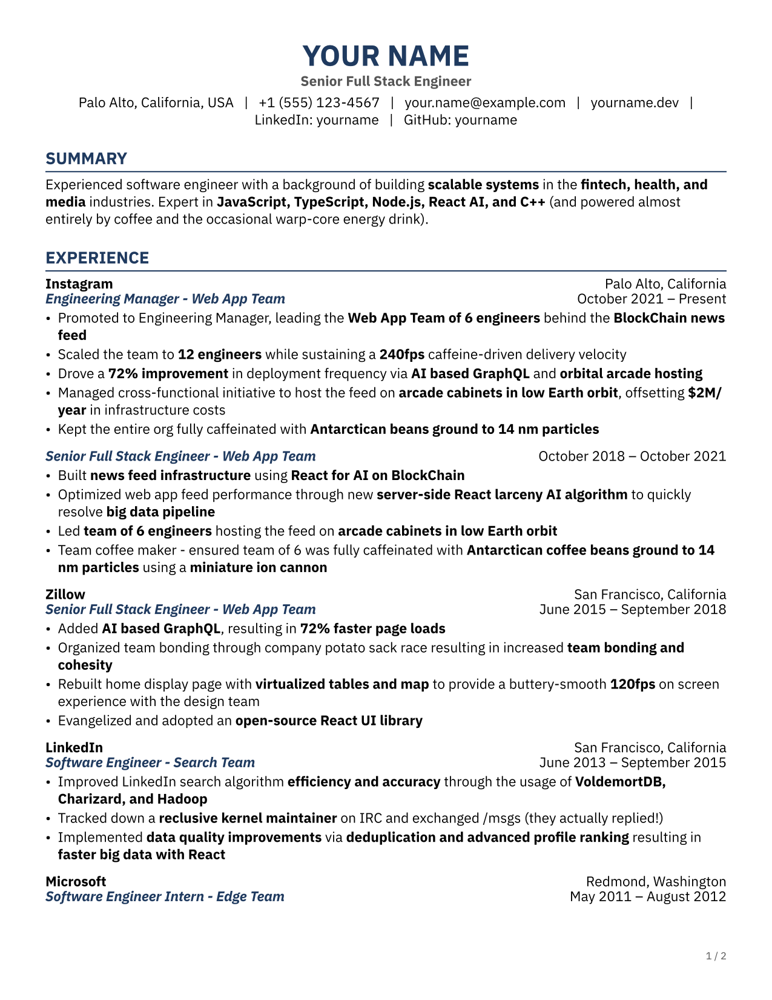
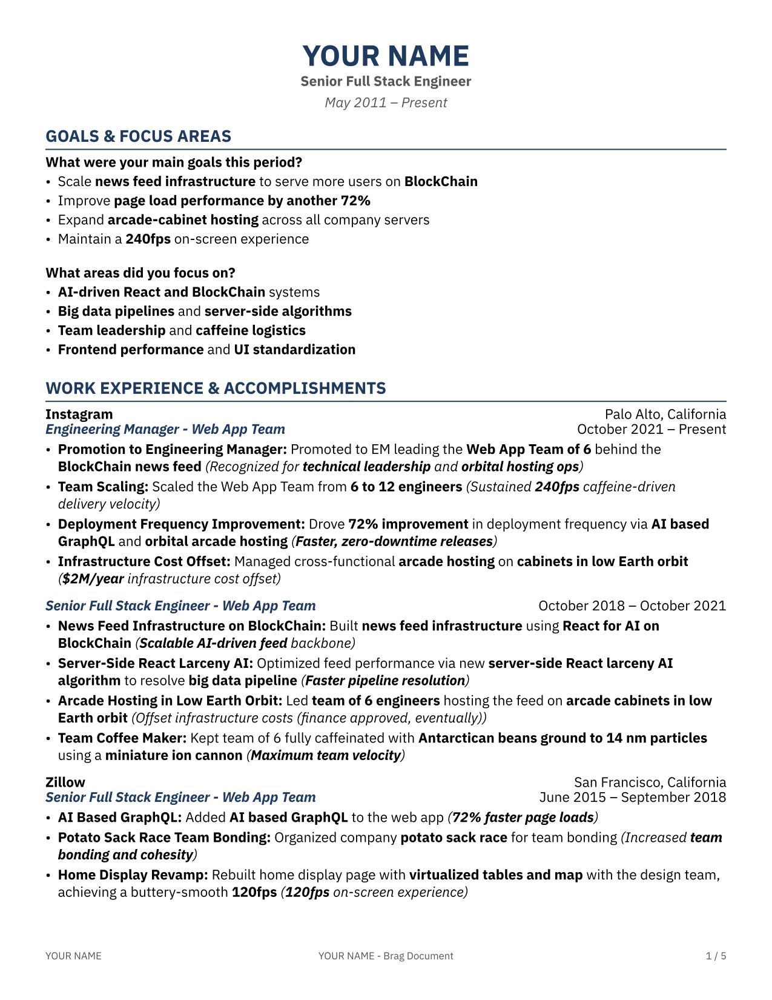

# Resume & Brag Document Template

ATS-friendly resume + brag doc in [Typst](https://typst.app). Edit text, get PDFs.

Sample data is fake — replace it with yours.

 

## Make It Yours (5 steps)

Edit `src/resume.typ` for your resume, `src/bragdoc.typ` for your brag doc. Only change text inside quotes. Keep quotes, commas, and brackets.

1. **Contact** — `name`, `title`, `location`, `email`, `phone`, `url`, `profiles`
   ```typst
   #let name = "Jane Doe"
   (network: "LinkedIn", username: "janedoe", url: "linkedin.com/in/janedoe"),
   ```
   Fill in both `username` and `url` to show a link. Delete the whole `(...)` line to hide it.

2. **Summary + experience** — update `summary`, `works` (company, role, dates, `highlights` bullets), `educations`, `skills_section`, `projects`.

3. **Bold key points** — wrap numbers and skills in `*...*`:
   ```typst
   "Led team of *6 engineers*, cut load time by *40%*"
   ```
   Use 1–2 per bullet. `**` = literal `*`.

4. **Preview** — no install: commit and download the PDF from the **Releases** page. Or locally:
   ```bash
   task compile   # needs Typst 0.15.1 + Task, fonts auto-loaded from src/fonts
   task dev       # live rebuild on save
   ```
   Without Task:
   ```bash
   typst compile --font-path src/fonts src/resume.typ src/resume.pdf
   typst compile --font-path src/fonts src/bragdoc.typ src/bragdoc.pdf
   ```

5. **Keep in sync** — use the same company names, roles, and dates in both files.

Empty fields (`""`) are hidden automatically. Missing keys are safe too.

## Options

- **1-page resume:** `#show: cvinit.with(author: name, title: title, compact-footer: true, compact: true)`
- **Short dates:** write `"Oct 2021"` directly.
- **Skills first:** move `#render-custom(skills_section)` to right after `#render-summary(summary)`.
- **Refresh screenshots:**
  ```bash
  typst compile --font-path src/fonts --pages 1 --ppi 150 src/resume.typ preview-resume.png
  typst compile --font-path src/fonts --pages 1 --ppi 150 src/bragdoc.typ preview-bragdoc.png
  ```

## Files

- `src/resume.typ` — your resume data
- `src/bragdoc.typ` — your brag doc data
- `src/functions.typ` — shared style (don't edit unless you know Typst)
- `src/fonts/` — vendored IBM Plex Sans, loaded via `--font-path src/fonts`

## Troubleshooting

- **Compile error?** You likely deleted a quote, comma, or `)`. Undo and edit only text inside quotes.
- **Link missing?** Fill in both `username` and `url`.
- **Fonts look wrong?** You forgot `--font-path src/fonts`. Use the `task` commands above.

## Releases

Every push to `master` auto-tags `v1.N` and attaches dated PDFs. Add `[skip release]` to a commit message to skip. PRs run a compile check.

MIT — see `LICENSE`.
